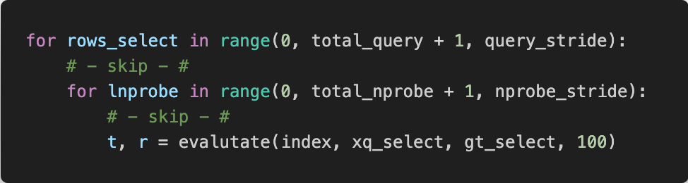
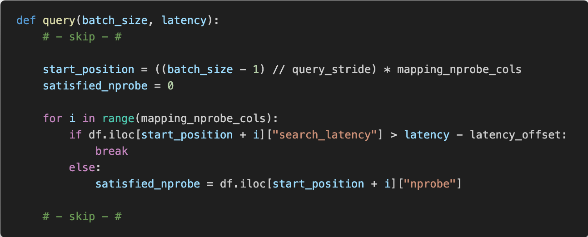

# 课程报告

123037910040 袁航宇

123037910018 刘茁

023037910001 吴晨鹏

## 问题描述

在近似最近邻（ANN）搜索算法的众多实现中，基于倒排文件（Inverted File）的方法，特别是IVF (Inverted File) flat，是一种广泛使用的技术。IVF flat算法是一种结合了传统倒排索引技术与量化技术的向量搜索方法，专为高维空间设计，以解决传统索引方法在处理大规模高维数据时的效率问题。

`IVF flat`算法的核心思想是将高维空间的数据点首先聚类到较小的、有限数量的类中。这一步骤通常通过k-means聚类实现，每个聚类中心（称为质心）代表了其包含的所有向量的中心点。整个数据集被划分为多个这样的簇，每个簇对应于一个质心。在实际的查询过程中，查询向量首先与这些质心进行比较，以确定最有可能包含目标最近邻的几个簇。

在确定了潜在的最接近的簇之后，`IVF flat`算法进入第二阶段，即在这些选定的簇中进行更精细的搜索。每个簇内部的搜索是通过直接计算查询向量与簇内所有向量之间的距离完成的，这是“flat”这一术语的来源，意指在每个簇内部使用的是“扁平”的、未经优化的距离计算方法。这种方法的优点在于简单直接，缺点则是如果簇内向量数量较多，计算成本依然很高。

`nprobe`参数在IVF flat算法中扮演着重要角色。它指定了在响应查询时要考虑的质心的数量，或者说是要搜索的簇的数量。增加`nprobe`的值通常会提高搜索结果的准确性，因为算法有机会检查更多的候选点，从而增加找到更接近查询点的机会。然而，这也意味着更高的计算成本和更长的响应时间，因为算法需要处理更多的数据。因此，设置合适的`nprobe`值是优化查询性能和准确性之间权衡的关键。

虽然技术熟练的用户可以手动调整`nprobe`以找到性能和准确性之间的最佳平衡点，但对于大多数用户来说，这一过程不仅复杂而且不直观。用户更容易理解和指定他们能接受的最大延迟（latency），而不是直接操作`nprobe`参数。此外，不同的应用场景对延迟的敏感度不同，例如实时系统可能需要极低的延迟，而批处理系统可能更关注准确性。

为应对这一挑战，提出一种允许用户基于延迟需求来间接配置`nprobe`的方法。用户可以指定每个查询允许的最大延迟，系统根据这一指标动态调整`nprobe`值。这种自适应选择机制的核心优势在于，它允许系统在保证满足特定延迟要求的同时，自动优化准确率。这不仅简化了用户的配置过程，也为不同业务需求提供了灵活的性能调整策略。

在设计这种动态调整`nprobe`的系统时，关键挑战在于如何精确预测不同`nprobe`设置下的性能和延迟，以及如何快速适应环境变化和数据变动。这需要深入研究索引结构、查询分布和硬件性能等多个方面，以确保系统既能快速响应用户需求，也能持续提供高效的服务。通过这种方法，我们希望找到一种动态平衡策略，在满足用户具体延迟需求的同时，尽可能地提高查询的准确性，从而优化整体系统性能。

## 方案设计

在本作业中，我们计划对现有的IVF-Flat算法进行改进，以更好地满足用户关于查询延迟和准确性的需求。首先，将引入一个基于离线性能采样的profile模块。这一模块的主要功能是在离线阶段，对已有的索引结构进行系统的性能测试。具体而言，该模块将测试和记录在不同的`batch_size`及`nprobe`组合设置下，系统处理查询的延迟(`latency`)。这种预先的性能采样将为在线查询时的参数优化提供重要数据支持。

通过这些离线采集的数据，我们可以构建一个性能预测模型，该模型能够根据输入的`batch_size`和延迟限制预测最适合的`nprobe`值。在用户进行在线查询时，系统首先读取用户指定的`batch_size`和期望的最大延迟(`latency`)。然后，算法查询之前构建的性能预测模型，找出在当前`batch_size`下，能够满足用户延迟要求的最优`nprobe`值。

这种方法的核心优势在于能够动态地调整搜索参数，以适应不同用户的性能需求。例如，对于需要快速响应的应用场景，系统可能推荐一个较低的`nprobe`值以减少计算延迟；而对于精确度要求更高的场景，即便延迟稍长，系统也可以选择一个较高的`nprobe`值以提高查询的准确性。这种灵活的参数调整机制，不仅提高了系统的用户体验，还增加了系统的适用范围。

综上所述，通过在`IVF Flat`算法中加入基于离线性能采样的`profile`模块，本作业方案旨在实现一种能够根据实际查询需求动态优化查询参数的智能查询系统。这将有助于在保证查询响应速度的同时，也能够尽可能地提升查询结果的准确性，从而满足更多样化的用户需求。

## 算法实现

作业算法基于`Faiss IVF-Flat`实现，作业在原有IVF-Flat方法添加了离线采样与在线策略选择部分，对于离线采样部分，代码实现示意如下：

对于在线策略选择部分，代码实现示意如下：

## 测试结果

### 延时约束

在本节测试中，将展示该动态算法对于可配置延迟约束的满足情况，测试取`batch size`为1510，以未修改的`IVF-Flat`为基线，记`IVF-Flat+high-nrpobe`为`H`，`IVF-Flat+low-nrpobe`为`L`，本作业中算法为`A`（`Adaptive`）。

取`acceptable_latency`为$[0.004-0.030]$，步长为0.002，实验结果如下：

取`acceptable_latency`为$[0.004-0.030]$，步长为0.0005，实验结果如下：

可以看到，对于`IVF-Flat+low-nrpobe`方法与本作业中的`Adaptive`方法，均可以保证时延满足期望，而`IVF-Flat+high-nrpobe`方法无法满足低延时约束，特别是在延时要求较小的情况下。这反映了原有固定`nprobe`方法的局限性，可以看到本方法的动态调整可以满足原有的延时约束要求。图中在步长更小的情况下`latency`表现出的实验出现了一定的波动，这是由于实验过程本身的随机性造成的，除去改波动外，仍能明显看出实际延时的变化趋势。

### 召回率变化

在本节测试中，将展示该动态算法对于准确率的影响，测试取`batch size`为1510，以未修改的`IVF-Flat`为基线，记`IVF-Flat+high-nrpobe`为`H`，`IVF-Flat+low-nrpobe`为`L`，本作业中算法为`A`（`Adaptive`）。

取`acceptable_latency`为$[0.004-0.030]$，步长为0.002，TOP1、TOP10、TOP100的recall实验结果如下：

取`acceptable_latency`为$[0.004-0.030]$，步长为0.0005，TOP1、TOP10、TOP100的recall实验结果如下：

可以看到，`Adaptive`方法成功在允许延时变大是提高召回率，有效的在召回率与时延中作出了trade-off。Adaptive方法在较低延时约束时能够选择合适的nprobe设置，保证延时的满足，在延时逐步放宽时，nprobe数量也明显提升，从而提高查询的召回率。`Adaptive`方法在时延约束极为宽松时，能够表现出比`IVF-Flat+high-nrpobe`更高的召回率，这也是因为`IVF-Flat+high-nrpobe`的fix设置无法利用该宽松延迟约束，从而完成更精确的查找。值得注意的是，`Adaptive`方法的召回率呈现阶梯状，这是两个原因造成的，一是虽然随着延迟约束放宽，`nprobe`设置变大，但召回率与`nprobe`的设置并不存在严格相关性，`nprobe`的增大并不一定导致召回率提升；二是本方法的离线采样本身的粒度约束了在不同延时下的策略生成粒度，本作业中较粗粒度的采样过程会导致一部分延时放宽后，策略不变的情况，这是对于离线采样开销的trade-off，在对于离线开销不敏感的情况下，可以准确率可以有更细粒度的变化。

## 总结

本作业实现了一个动态近似最近邻搜索算法，该算法通过离线测量不同`batch_size`和`nprobe`组合下的查询延迟，构建性能预测模型，以便在线查询时根据用户设定的延迟约束自动选择最优`nprobe`值。这一方案不仅优化了查询的响应时间和准确性，也极大提升了用户体验和系统的适应性。
